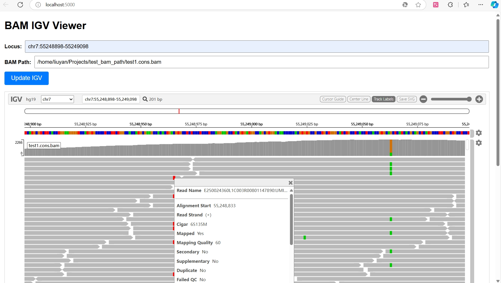

# BAM IGV Web Application
This project provides a web-based interface for visualizing BAM files using IGV.js. Users can view bam data in an interactive IGV browser, specifying loci of interest for visualization.
Input bam files should be accessible and valid in the app server. 


## Features
+ **Interactive Genomic Visualization**: View genomic alignments and variations from BAM files directly in the browser using the IGV.js library.
+ **User Customization**: Users can input the locus (chromosome region) and BAM file path, and the visualization will update dynamically.
+ **Genome Reference**: The app uses the `hg19` reference genome, but it can be customized to support other genomes if necessary.

## Requirements
+ Python 3.x
+ Flask (for backend)
+ IGV.js (JavaScript library for genomic visualization)

## Installation
### Step 1: Clone the Repository
Clone the repository to your local machine:

```bash
git clone https://github.com/liuyanbioinfo/igv_web_app.git
cd igv_web_app
```

### Step 2: Download the reference files
Download hg19 reference genome and index files.

(Optional) You can change to other refernce versions by editing `fastaURL` and `indexURL` in `/templates/index.html`:

```bash
cp /path/to/hg19.fa /static/ref/hg19.fa
cp /path/to/hg19.fa.fai /static/ref/hg19.fa.fai
```

### Step 3: Install Dependencies
Install the required Python packages using `pip`:

```bash
pip install -r requirements.txt
```

### Step 4: Run the Application
Start the Flask application:

```bash
python run.py
```

The application will be available at `http://127.0.0.1:5000/` by default.

## Usage
1. **Open the Web Application**: Go to `http://127.0.0.1:5000/` in your web browser.
2. **Input Locus**: In the "Locus" input field, provide a chromosome region in the format `chr7:55241607-55241807`. This will specify the region of the genome to display in the IGV viewer.
3. **Input BAM File Path**: Provide the absolute file path to the BAM file you wish to visualize. Ensure the path is valid and the file is accessible.
4. **Click Update IGV**: Once the locus and BAM path are entered, click the "Update IGV" button. The IGV viewer will refresh and display the BAM file content for the specified locus.
5. **Visualize Data**: The genomic alignments will be displayed in the IGV viewer. You can zoom in/out, scroll, and interact with the visualization.


